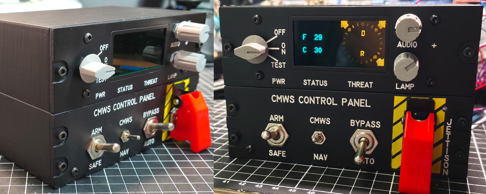

# AH-64D-Apache CMWS Control Panel

This is my **CMWS (Common Missile Warning System) Control Panel** build for the DCS AH-64D Apache.

The panel is driven by by **DCS BIOS (Skunkworks)** an **Arduino Mega** and a **1.3” OLED display** . The Mega is required because the Uno simply doesn’t have enough RAM to run my code reliably - save yourself the headache and go straight to the Mega.

The Threat Sector Index is implemented with discrete LEDs for proper “something wants to kill you from that direction” vibes.

**Total cost: ~50€** depending on what you already have in your parts bin.

**Difficulty: Medium** – you should know how to flash code to an Arduino using the Arduino IDE and setting up DCS BIOS. If you have no idea how to set up DCS BIOS or upload code to an Arduino, make sure to check out the excellent tutorial by Hornet’s Nest! 

If that still feels too fiddly, feel free to contact me on Reddit - I can offer a pre-flashed Arduino as an alternative.
As with my other projects, I’ve included extra STL files for builders without a laser engraver, so you can simply 3D-print the labels instead.

There is also an alternate Threat Sector Index version with a hole mask. It’s not quite as pretty as the laser-engraved version, but it absolutely does the job.
If you’d prefer a proper laser-engraved Threat Sector Index, I can send you one - just contact me on Reddit.

All files are located in the STLs.zip directory.

# **RTFM** -- read the included **How-To.pdf** !!

Timelaps Video complete assambly process - from CAD to Combat: 

 DONATE: Feel free to say thanks... https://www.paypal.com/donate/?hosted_button_id=XG6RA9RWPM84Y

**LICENSE:**
Creative Commons Attribution-NonCommercial 4.0 International Public License
